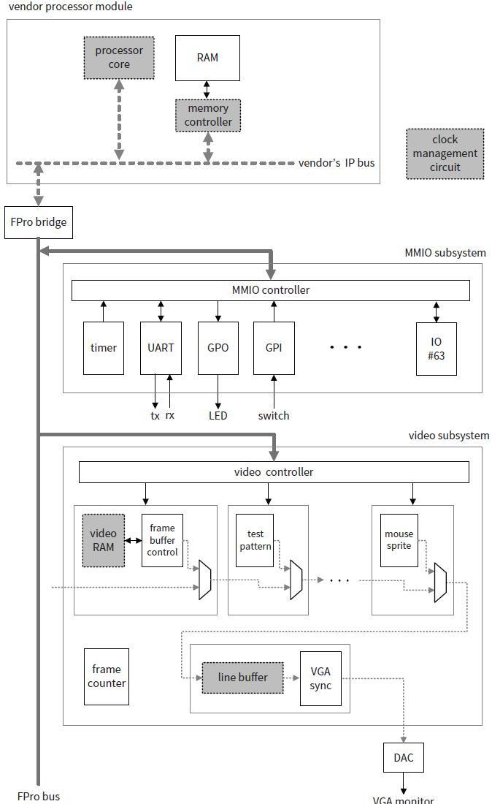
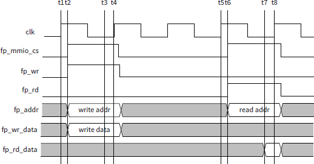

# 写在前面
本文图片均来自《FPGA prototyping by SystemVerilog example》
# 项目背景和目标
- 简单 
  FPro SoC 平台定义了一个简单的同步总线协议和直接的设备驱动结构。一旦硬件电路开发完成，通过添加一个简单的接口电路和设备驱动，就可以将其转换为 IP 核。然后该核可以集成到现有的嵌入式系统中。
- 功能 
  FPro SoC 平台提供多种 I/O 外设和常用串行接口（UART、SPI 和 I2C），并包含可工作的设备驱动程序。它类似于裸机 32 位微处理器板，可以实现针对此类板设计的实际项目。
- 便携性 
  除处理器外，FPro SoC 的 IP 核从零开始使用 HDL 开发，不使用任何供应商的专有组件。总线协议和设备驱动程序也不依赖于任何特定的商业平台。因此，IP 核和软件代码是可移植的，可以用于不同的 FPGA 设备和原型板。
- “向上兼容”. 
  尽管 FPro SoC 平台简单，但其开发遵循严格且经过验证的设计原则和实践。这些知识和技能未来可以应用于更复杂的商业平台和更大的项目。事实上，开发的 IP 核和驱动程序可以轻松修改，以便集成到现有的商业 IP 框架中。
- 有趣 
  因为开发的系统就像一个真实的微处理器板，它可以集成现有的 I/O 模块，并快速开发一个功能原型项目。此外，这个平台可以提供硬件加速能力，因此比任何微处理器板都更具能力和更灵活。结果，我们有机会开发有趣和具有挑战性的项目，并让学习硬件变得更加“有趣”，而不是“为了硬件而学习硬件”。

# 硬件架构
FPro的硬件架构如下图所示

## 处理器
处理器模块由一个处理器、一个内存控制器核心和 RAM 组成。这是使用供应商 IP 核构建的部分。要在 FPro SoC 平台上使用，处理器核心必须表现出以下特性：

- 32 位宽数据路径
- 32 位内存地址空间
- 内存映射 I/O 方案 用于 I/O 访问
## FPro 桥接器和 FPro 总线
### 命名规范
`fp_addr`（主设备到从设备）。它是一个 22 位地址信号，用于标识目标 I/O 寄存器或 MMIO 或视频子系统中的内存位置。请注意，FPro I/O 子系统的内存空间是“字寻址”的，这意味着 `fp_addr` 指定的位置是一个 32 位字。
`fp_rd_data`（从设备到主设备）。它是一个 32 位信号，传输读数据。
`fp_wr_data`（主设备到从设备）。它是一个 32 位信号，传输写数据。
`fp_rd`（主设备到从设备）。它是一个与读操作相关的 1 位控制信号。
`fp_wr`（主设备到从设备）。它是一个用于启动写操作的 1 位控制信号。
`fp_mmio_cs`（主设备到从设备）。它是一个 1 位使能（即“片选”）信号，用于激活 MMIO 子系统。
`fp_video_cs`（主设备到从设备）。它是一个用于激活视频子系统的 1 位使能信号。
### 时序要求
为了设计的简单，我们要求读写都在一个周期内完成。

写周期:在时钟上升沿，标记为 t1 时，桥接器完成从处理器本地总线翻译写命令，将地址和写数据放到 fp_addr 和 fp_wr_data 上，并激活 fp_mmio_cs 和 fp_wr 信号。解码逻辑解码地址并激活指定 I/O 寄存器的使能信号。在下一个时钟上升沿，标记为 t4 时，指定寄存器采样并存储写数据。

读周期:在时钟上升沿，标记为 t5 时，桥接器完成从处理器本地总线翻译读命令，将地址放置在 fp_addr 上，并激活 fp_mmio_cs 和 fp_rd 信号。多路复用逻辑检查地址，并将指定的 I/O 寄存器输出路由到 fp_rd_data。在下一个时钟上升沿，标记为 t8 时，桥接器采样并存储数据，并通过其本地总线转发给处理器。请注意，fp_rd 信号不直接参与读取数据。它实际上充当一个“移除”信号，用于清除 I/O 核中的旧数据项，以便为新的数据项腾出空间。

### 时序分析
对于写操作
在 t1 时，主设备发出写命令。
在 t2 时，所有总线信号在 $t_{CQ}$（时钟到 Q 延迟）后稳定，解码电路开始工作。
在 t3 时，解码后的使能信号经过 $t_{DEC}$ 延迟后到达指定的从设备 I/O 寄存器。
在 t4 时，指定的从设备 I/O 寄存器采样并存储写数据。

设时钟周期为$t_{CLK}$,寄存器建立时间为$t_{SETUP}$
时序约束为$t_{CQ}+t_{DEC}+t_{SETUP} \lt t_{CLK}$

对于读操作
在 t5 时刻，主设备发出读命令。
在 t6 时，所有总线信号和 I/O 寄存器输出在 $t_{CQ}$ 后稳定，并且多路复用电路开始工作。
在 t7 时，指定的源读数据在 $t_{MUX}$ 延迟后被路由到读数据线。
在 t8 时，主设备采样并从总线获取数据。

时序约束为$t_{CQ}+t_{MUX}+t_{SETUP} \lt t_{CLK}$